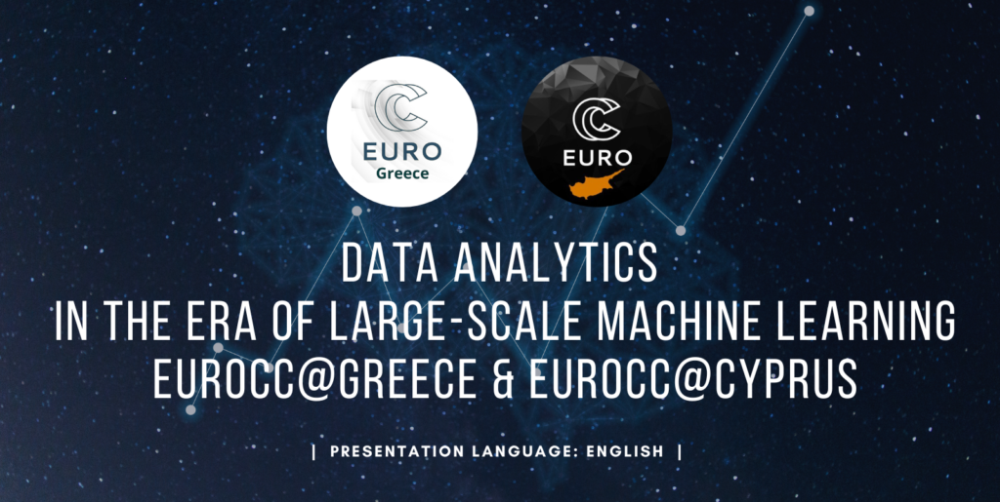

  

## Table of Contents
1. [Description](#description)
2. [Information](#information)
3. [Requirements](#requirements)
4. [Syllabus Outline](#syllabus)
5. [Certificate](#certificate)

## Description

This event was part of the EuroCC2 project and the National Competence Center activities, in collaboration with the Greek National Competence Center, and it provided training on the following subjects:

- Large-scale generative models for language and vision (including LLMs): How they work – and what we still do not know about them
- PyTorch Neural Networks: Running on CPUs and GPUs
- Streamlined Data Analysis with NBML: Harnessing AI Algorithms for Predictive Modelling
- Efficient Data Cleaning and Pre-processing Techniques for Robust Machine Learning
- GPU CUDA Programming

## Information

This event was part of the EuroCC2 project and the National Competence Center activities, in collaboration with the Greek National Competence Center.

More details [here](https://eurocc.cyi.ac.cy/data-analytics-in-the-era-of-large-scale-machine-learning/).

## Requirements
All attendees will need to bring a laptop or tablet with the
following:

- A web browser
- A PDF viewer
- An ssh client, e.g. a terminal for Mac or Linux, or Windows with
  [WSL](https://learn.microsoft.com/en-us/windows/wsl/install) or
  [PuTTy](https://www.putty.org) (for the "GPU CUDA Programming"
  session)
- The ability to edit text files on a remote server. E.g. via
  text-based Emacs or Vim, or via the [VS Code Remote -
  SSH](https://code.visualstudio.com/docs/remote/ssh) extension or
  similar (for the "GPU CUDA Programming" session)
  

## Syllabus Outline

### Day 1

> - Large-scale generative models for language and vision (including LLMs): How they work – and what we still do not know about them. _Constantine Dovrolis and Mihalis Nicolaou_
> - PyTorch Neural Networks: Running on CPUs and GPUs. _Pantelis Georgiades_
> - "Tensorization and uncertainty quantification in machine learning". _Yinchong Yang, Siemens AG_
> - Streamlined Data Analysis with NBML: Harnessing AI Algorithms for Predictive Modelling. _Nikos Bakas_

### Day 2

> - Efficient Data Cleaning and Pre-processing Techniques for Robust Machine Learning. _Charalambos Chrysostomou_
> - GPU CUDA Programming – Session 1. _Giannis Koutsou_
> - GPU CUDA Programming – Session 2. _Giannis Koutsou_

## Certificate

The certificate for the course can be found below:

["Data analytics in the era of large-scale machine learning" - Greek National Competence Center)]() (Issued On: May 2023)
